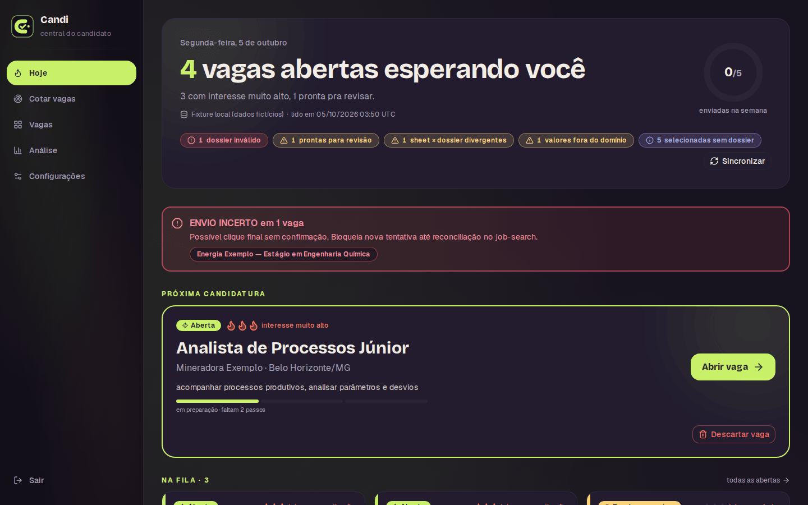
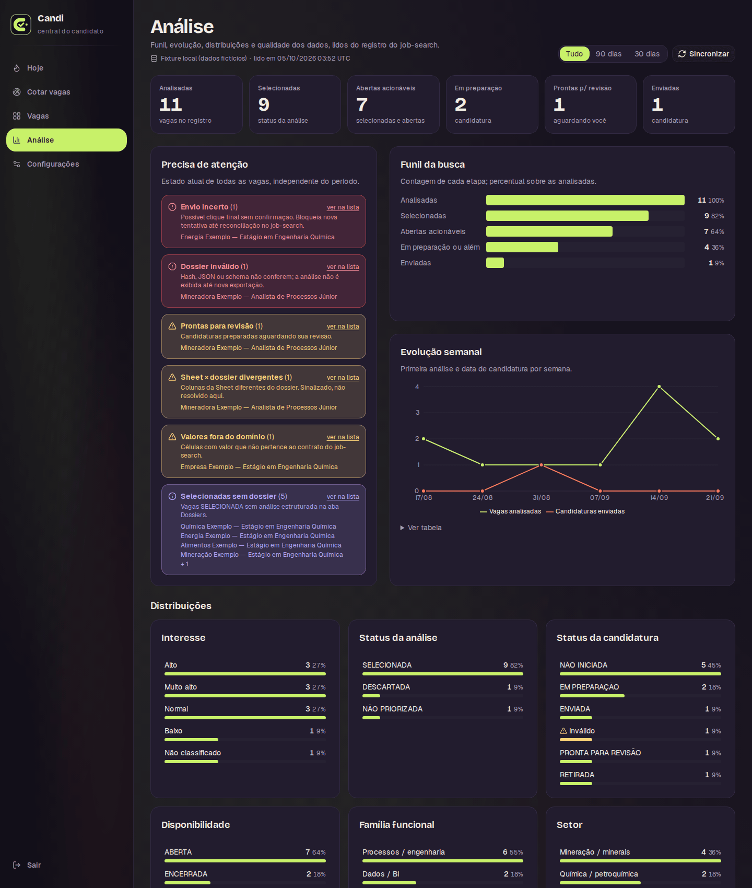
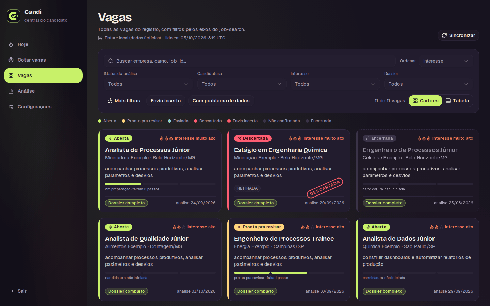
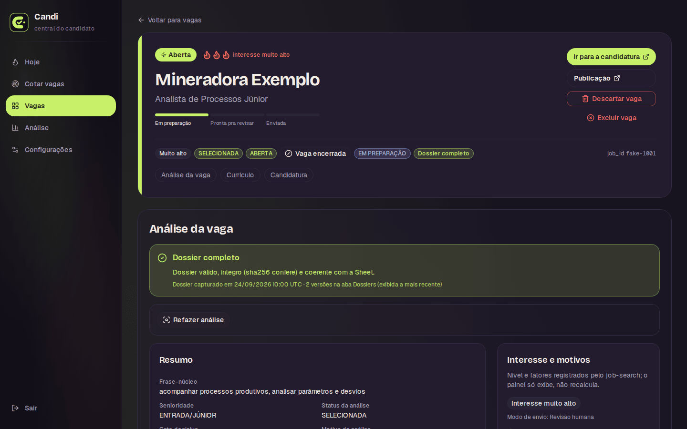
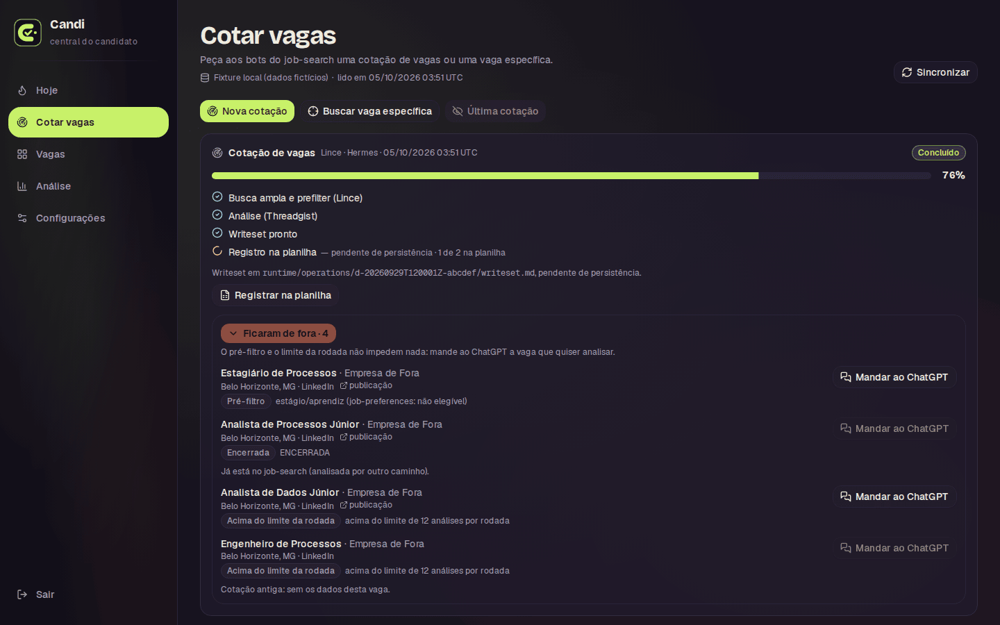
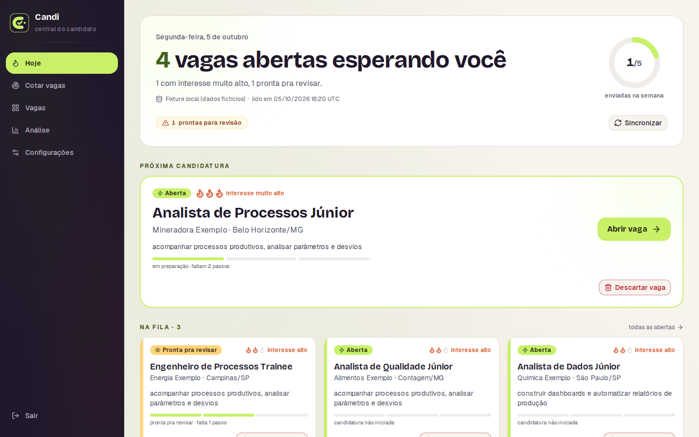

# Candi — central do candidato

O Candi é a central de quem está procurando emprego. Em um só lugar, o candidato:

1. **Cota vagas**: pede uma busca e recebe as vagas que combinam com ele, ou indica uma vaga específica que encontrou.
2. **Recebe uma análise personalizada de cada vaga**, feita de acordo com o seu perfil: o que a vaga pede, onde ele atende, onde há lacuna e quanto vale a pena se candidatar.
3. **Gera um currículo personalizado para aquela vaga**, sem inventar experiência, e pode pedir ajustes em texto livre.
4. **Tem o preenchimento da candidatura automatizado**: os dados são preenchidos no portal da vaga e o envio final fica com ele, que confere e clica.

E acompanha tudo: a fila do dia, a meta da semana, o funil da busca e o estado de cada candidatura.



> Todos os prints usam dados fictícios (empresas e vagas de exemplo), gerados com o contrato do `job-search` pelo mesmo gerador da fixture local; nenhum dado real.

## Quem faz o trabalho: bots de IA

O Candi é o painel. O trabalho pesado é feito por bots de IA do repositório `job-search`, que o painel aciona com um clique:

- **Bots de IA, no Hermes ou no Grok bot**: cada etapa tem o seu bot (busca, análise, currículo, candidatura), com um papel e regras do que pode e do que não pode fazer. Os mesmos bots rodam em duas plataformas, o Hermes (Hermes Agent, na máquina do candidato) e o Grok bot, e o painel trabalha com as duas: no Hermes ele dispara o bot direto; no Grok bot ele entrega o comando pronto para colar.
- **ChatGPT**: faz a análise de cada vaga contra o perfil do candidato e propõe as mudanças do currículo para aquela vaga.
- **Claude in Chrome e Claude Design**: o Claude in Chrome edita o currículo no Claude Design e exporta o PDF, e preenche os formulários de candidatura no navegador, parando antes do botão de envio.
- **Google Planilhas como base de dados**: cada vaga, análise, evento de candidatura e fonte de busca fica registrado em uma planilha. O painel só lê essa planilha; quem grava são os bots, com regras e validações próprias.

O perfil do candidato (experiências, evidências, preferências) e as regras de cada etapa ficam versionados no `job-search`, e os bots não podem inventar fato nem transformar projeto ou curso em experiência profissional.

## As telas

- **Hoje**: próxima candidatura, fila de vagas abertas, meta da semana e o que precisa de atenção.
- **Cotar vagas**: pede uma nova busca ou a análise de uma vaga específica e acompanha cada etapa até o registro na planilha.
- **Vagas** e **Vaga**: todas as vagas com filtros e, em cada uma, três seções: análise, currículo e candidatura, cada uma com os seus botões.
- **Análise**: KPIs, funil da busca, evolução semanal, distribuições, cobertura de fontes e qualidade dos dados. Todo gráfico tem visão em tabela.

| Análise                                                       | Vagas                                                  |
| ------------------------------------------------------------- | ------------------------------------------------------ |
|  |  |

| Vaga                                                                    | Cotar vagas                                                             |
| ----------------------------------------------------------------------- | ----------------------------------------------------------------------- |
|  |  |

Tema claro:



## Por dentro: detalhes técnicos

Esta parte é para quem quer ver como o painel foi construído.

### Arquitetura

```
           regras e perfil                        estado operacional
   ┌──────────────────────────┐            ┌──────────────────────────┐
   │ job-search (Git)         │  escreve   │ Google Planilhas         │
   │ bots: busca, análise,    │ ─────────▶ │ vagas, eventos, dossiês, │
   │ currículo, candidatura   │            │ cobertura de fontes      │
   └────────────▲─────────────┘            └────────────┬─────────────┘
                │ dispatch.py                           │ Sheets API
                │ argv fixo, env mínimo,                │ somente leitura
                │ texto livre só por stdin              │ (service account)
   ┌────────────┴───────────────────────────────────────▼─────────────┐
   │ Candi (Next.js 16, local)                                        │
   │ parsing por cabeçalho → validação zod + sha256 → JobView         │
   │ → métricas puras → páginas (Server Components)                   │
   │ Auth.js (Google, allowlist) em três portões                      │
   └──────────────────────────────────────────────────────────────────┘
```

O painel **nunca escreve na planilha** e não tem credencial de escrita. Quando o usuário pede uma ação (registrar uma busca, descartar uma vaga), quem grava é o `job-search`, com a credencial dele e as validações dele.

### Destaques técnicos

Cada item aponta para onde está no código.

- **Sheet como fonte somente leitura, validada na entrada.** Parsing por nome de coluna, não por posição; enums espelham o contrato do `job-search` e valores fora do domínio são sinalizados, nunca corrigidos. O dossiê estruturado de cada vaga passa por schema zod e só é exibido se o `sha256` do JSON bater com o registrado (`lib/job-search/sheet-parse.ts`, `lib/job-search/dossier-schema.ts`, `lib/job-search/dossiers.ts`).
- **Métricas e funil como funções puras.** KPIs, funil, séries semanais e distribuições são calculados sobre `JobView` e testados em Vitest; a camada de apresentação só define rótulos, cores e ordem (`lib/job-search/metrics.ts`, `lib/job-search/present.ts`).
- **Orquestração de bots com superfície mínima.** O despacho roda `dispatch.py` do `job-search` com `execFile` (sem shell), argv fixo, env reduzido a uma lista explícita, timeout e saída JSON validada com zod; recusas viram mensagens claras na interface (`lib/ops/dispatcher.ts`, `lib/ops/schema.ts`, `lib/ops/present.ts`).
- **Texto livre só por stdin, com guardas dos dois lados.** As três entradas de texto do usuário (vaga indicada, orientação para um currículo travado, pedido de edição do currículo) passam por normalização NFKC, remoção de caracteres de controle, limite de 10 a 1500 caracteres e bloqueio de padrões de comando no painel, e de novo no dispatcher; nunca vão para a linha de comando (`lib/ops/intake.ts`).
- **Autenticação fail-closed em três portões.** Auth.js com Google e allowlist de um e-mail: o proxy barra páginas e `/api/*`, o layout do dashboard exige sessão, e a leitura da Sheet real recusa sem sessão permitida. Cada server action chama `getAllowedSession()` por conta própria (`auth.ts`, `proxy.ts`, `lib/auth/access.ts`, `app/actions/`).
- **Local-first.** Roda na máquina do dono com `pnpm build && pnpm start`; sem deploy, sem banco de dados, sem dependência de provedor de hospedagem.
- **Testes e CI.** Testes unitários em Vitest (parsing, schema, métricas, regras de apresentação, guardas de texto) e testes E2E em Playwright contra um **dispatcher falso** com a mesma CLI e o mesmo JSON do real, que avança uma etapa por consulta (`e2e/fixtures/job-search-fake`). O E2E não tem bypass de login: o servidor sobe com segredos descartáveis e os testes emitem o cookie de sessão. GitHub Actions roda lint, Prettier, testes com cobertura, E2E e build (`.github/workflows/ci.yml`).

## Como rodar

Requisitos: Node.js 20+ e pnpm.

```bash
pnpm install
cp .env.example .env.local   # JOB_SEARCH_DATA_SOURCE=fixture já é o padrão
pnpm dev                     # http://localhost:3000
```

Sem configurar a Sheet, o painel lê a fixture local. O login continua obrigatório: preencha em `.env.local` `ALLOWED_EMAIL`, `AUTH_SECRET`, `AUTH_GOOGLE_ID`, `AUTH_GOOGLE_SECRET` e `AUTH_TRUST_HOST=true` (client OAuth do Google com redirect `http://localhost:3000/api/auth/callback/google`). Nunca commite credenciais.

Para ver tudo funcionando sem conta Google, rode a suíte E2E: ela sobe o servidor com a fixture, segredos descartáveis e o dispatcher falso.

```bash
pnpm exec playwright install chromium
pnpm test:e2e
```

Com a Sheet real: `JOB_SEARCH_DATA_SOURCE=sheets`, `JOB_SEARCH_SHEET_ID` e `GOOGLE_SA_JSON_PATH` (service account somente leitura, fora do repositório). O despacho de bots fica desligado até `JOB_SEARCH_DISPATCH_ENABLED=true` e `JOB_SEARCH_REPO` apontando para o checkout do `job-search`.

### Qualidade

```bash
pnpm lint
pnpm format:check
pnpm exec tsc --noEmit   # o build não faz type-check
pnpm test                # Vitest
pnpm test:e2e            # Playwright (Chromium)
pnpm build
```

## Stack

Next.js 16 (App Router, Server Components, Server Actions), React 19, TypeScript, Tailwind CSS 4, Radix UI (shadcn/ui), Recharts, zod, Auth.js v5, Google Sheets API, Vitest, Testing Library, Playwright, GitHub Actions.

## Documentação

Arquitetura e contrato com o `job-search`: [`docs/plans/2026-09-25-job-search-visual-layer.md`](docs/plans/2026-09-25-job-search-visual-layer.md). Central de operações: [`docs/plans/2026-09-29-ops-center-bot-triggers.md`](docs/plans/2026-09-29-ops-center-bot-triggers.md).
